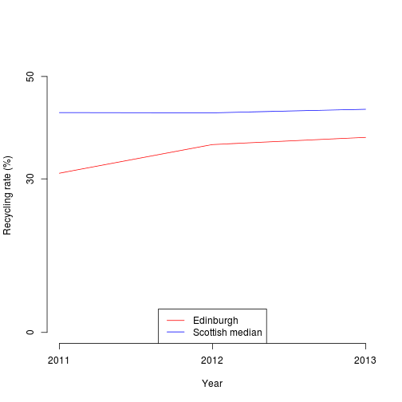

A tool for visualising waste management data
========================================================
author: Billy Harris
date: August 2015

Introduction
========================================================

This presentation covers a simple data visualisation widget built for the Data Products module of the 
Coursera Data Science specialization.

- Users can explore waste and recycling data for Scottish local authorities.
- Covers years 2011-2013 (2014 data is not published until September 2015)
- Tool outputs values for three years and plots a time series vs Scottish median performance.
- All data downloaded from the website of the Scottish Environmental Protection Agency (SEPA).

Tool available at: https://billyharris.shinyapps.io/shiny

How it works
========================================================

- ui.R file creates two dropdown menus, one for local authority, one for the variable to view 
(total waste arising or recycling rate).
- server.R includes the data set and a function that generates both text and graphical output 
based on the user's selections.
     - Alternative would be to host data remotely and load using read.table.
- This is then passed back to ui.R for display.

Example of graphical output
========================================================
<small> (Data and function have echo = FALSE to enable display) </small>


```r
makeplot("Edinburgh","recycling")
```

 

Applications of this tool
========================================================

- Could be expanded to enable comparison of authorities on a wider range of metrics.
- Allows decision makers to explore data interactively.
- Could be adapted to supply data to consumers (e.g. school or hospital performance) on a range of metrics.

